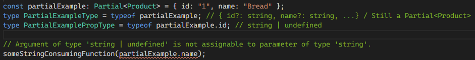
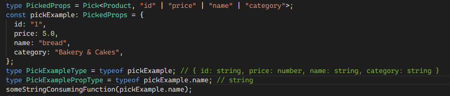
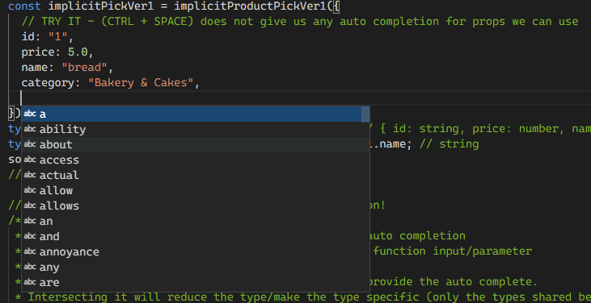
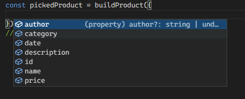
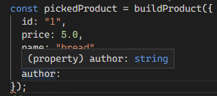

# Creating a type safe implicit Pick

This article discusses the implementation of an implicit pick, the reason for it & what makes it special.

Here is a Typescript Playground with examples that will be used as a reference.

```ts
//#region Setup - Example Interface and consuming function.
interface Product {
  id: string;
  price: number;
  name: string;
  description: string;
  author: string;
  date: Date;
  category: string...
```

[Playground Link](https://www.typescriptlang.org/play?jsx=0#code/PTDECcFMHMEsHsB2ACAypALgVwA7ILTICiAHgIYC2OANpMgJKIaTgBmZAxnWYgCbIckAZywVYiaMlZZEHDAkQA6AFDjmbTnQAK4eLyxzkAb2XJksXgC5kQjOHHQA3KeQ57Xa4lEAjFs7OIlJDWtvYS-si8kEIc9jjySCF2DhFkWBgAFvDgSWFOLrxkzNYAIkWQERzl0NkAnrkpygC+ylEc1GRQAsIYNvAUkKjJEgDCwqIOAGIycgrWABShDRIAlMgAvAB8yABu8BbOIKCQfFBwSMrKR2cKxORUtMjwrMhanfJk1FcAVN+m38gAOp0ISQOiZIrITJ0HDvWCfZCQe40bjUajwADuQmQWGxGHgrngOCwHWYUIydFYsEg1F42IxdAxPF6rF0FFeun0chUyABAAlMZAdixzC8GcgmUwoQTOFwhHiKU9vAArSByAA0EpBYPJkOhrl0OGxZGxtlgaKe8QUnx5ANQBPE5PgoIEJuiyHm2VdoPpFJQ4slvVCsDkIowtRw0RWmoDzNeIYA1gBCf7AZSCRC2Vxwz6kSgo6xvcAfagAHh0egMGG262M5isyAARABGRuawIDayNgBCUDIvEbyCaznDkdeOeoeYekAAKhG6LXR5Bntni-DJ8jaI5kCA6xYAPzLaDtoKHmzDY-IRTXpo7tDyC1kcdrz7lzlVzbKJfPktTlEVnA5zHRd5xXWEXw3fNaEUA4d2Ac88mQAAfHE+EgKlEEgXhLl3ABBcBoFEE5ehXb8AHJgwkZDUKiDCsLI8xsUQeBehNIRYGgQJvEefFVyCdQnhecjKOgMiVCEfpBgvMZMwmCRplkBJEHmcDf03SBFA7SAVkOMATl4G4LiuMBDJQP9HhXLREx+P5eXjDgE2QOBhWxXFkB4JVVUMDFYEyJ5EGoWpyUpalaXpOgqi6MhvHgdJbSBEEH2oZAMjIYUoXnGwyFYTBak1NJeMEaclI9EYZwAJQAGWQABqNAtFwkYiDWAAydzvHNXygt4qB2DkL15g4VKJEgYAoAoeBhTWNwiSEeLu3SLUUrS8EMlgbFG30GgQyKBRB1IiMHCeLBwANWaCGQZspC9WJIF2qj9SshyPRnVBkEqnheB09y+Eu67Tv1ThsAReAVTVXp5gAKTej6+BWf5kAAWQ4jJemY3pfGQCgDAyQSfsYkRKS9IQKE+WhTrUFg+uiTVvEWqoUExiauhXDz1sJ4AeGY2oeC4f7kA6AiRUpjQ5VtBHKswPFwCC277skNmHhDXz7Mc6RFIUW002-J6EywgDsVrXW30rDUmwsQcUMbNwQ0gS2my0+3GyqZgahlxtNmcDMsxwRNzOCVX9cNQ3jBcCwu1bdUXBtjxkAAVkUAAGKOAiCLtvD7AcU9dV26i7bsyD1mXkDakZC+iNtmhHTLdf9oCFwyyMwL99Tt13Ix6yPTUY4DrwKF8cAT07BCHE1F2YDzkeqJaHWW6gyAAPrjZG+XF5fYc-3NKCNv4JE5QJIGIY8hkkQxHkmYlJUufpy3gYdOM45ThgBQcJM5+kAYJWOBV3XkAANRYOxD+zYbIIxnGtbE6tZgfx8o+NEmIcR4gJHLMkittrfwwIFQO-BQZeV6IAHg3ACR+wjYE55zTJVSulb8Qhsq5RLu1Tq4ZpTIF6kDAaQ0eDQFGuNSa2kzpGninyAA8oCIgf8iDlXMEGMEFAFSQnFOiLMsVToFWQf0FEJV5hlSqrVeqjVmrMJwESEk5RjqnVweDeKpCkBYK4b0V6iJwC6HAEIYAAx5RkC4diWAQk1oSGxDUCUugJDXkUMgOmaMHSIFYNkUmJUMR+gEH2eQD1FQWLkP8MBEDGJPATGQPK4TFr0HJOIRy4oGaRAJL4DAAlAC8G4AOD3Uzph6IU80vB6Bf18rrAB4ArrrBcKWGcmx5hrC2AMgA0oiEgzA+DYj1rUFcQyVLB0LImQZmpxmbBWKshy6zkCbI2J+MwZgZpGi9i02AnSMAVi5NcxMPS+mtNpB09BXT7ksGbCbW5wz77e16Jc15dyHIPOXgC6gytrnvjkN0j58wTBmF3BVAAmgwGcF0tEVWqnVVADUmprF4PAd06MnKwHSm5HgQVVHdGKrcGJp1TnhVdCgXEkAw4NhbJXE57gA4J2Ti4LS6dM6cpzhPGW+dy7F1LuXIQlcmj32-C88FGCYW9KXiBJuLwwUQpVc2Hee4GwiW7tyzwPgWBDwDoakVbt6hT0kDPTKirtXvN6YvTK6rV7mCuTq2+FQ4K2v3pJI+DgT5yWgApaByktXKudc2H198jj6VMq-CA78UCOowarf+gDbgACYLo+T8lSoqGiFApmAL8BGuEGQH0gEmBKyBmIYmWulNBSqf6JieVEU6BbcZFvUbQJSWS6CkzgBwSIPicpQFkAHfUItQQRpXvzfUUCSriGJBgYA4F+IsEyXZcBMIJzuXgViYK3RZIDABgSWE8pzAoAZfQmaOwLCrW4OkNRxUNII0YOoedKTJAq1gclKAXIX0rzceXU91DIzfypGOz0AVuqKiXKaVKwHwmYAZCcKEGICTIfcl0FlX0ml-M7emt5z1+lmEGT8w5EypkzLpMgeZizhkMsLBOaj9DjYzg2VsnZCY9kHLGcc-hQhnDNMzBjLAbSblVmXnTNpZGgUCdk3IH55zJOuETEHU2vRawKdpKpjAcK2UR2FT3awvLs4CqbBnO6WcXDj2teKouQUpV6xlVHOV1cxy6x07c5eS5m4OX81WPVHdw62qNbbE1-czUNrTlFq1k8RJDi-DXbTvAKwcCrK64CK9gt6yy1CjAPq9V7xrUG0Y4wz5hovgoK+IXiu6bjbpR+BlU1AA)

## Why an implicit Pick? Why not Partial?

Partial is great if you want to create an object with some of the values from a given interface. However when the object is used (via property access or through some consuming type), the object still is a `Partial` - as in all properties are optional, even if you have provided a value.


In these cases, what we really want is a `Pick`ed object - an object with the properties we want "picked" out of the original interface.

## The Verbosity of Pick

Pick is perfect, it gives us the exact strict type that we want, however (as shown) it is very verbose.

For each prop we want, we need to write it for the `type` as well as for the object.
For small objects, this might not be much of an issue - however this can become very large the more props we want.

So now lets design an implicit pick!

## 1st Implicit Pick - okay, but no IntelliSense 😢

Here is the design of the initial implicit Pick.

```ts
const buildImplicitPickVer1 =
  <T>() =>
  <K extends keyof T>(props: Pick<T, K>): Pick<T, K> =>
    props;

// Usage
const pickProduct = buildImplicitPickVer1<Product>();
const implicitProduct = pickProduct({ id: '1', ... })
```

Breakdown:

- `<T>() =>`
  - The is a factory function part that allows you to build a pick on whatever type you provide it.
- `<K extends keyof T>`
  - We have a generic type `K` that is constrained to the type given in the factory.
- `(props: Pick<T, K>): Pick<T, K>`
  - this parameter gets inferred as the developer types in the keys of their object.
  - Invalid keys will spit out an error (since does not match the Generic type)
  - Invalid values for the key will spit errors, since it won't match the `Pick`ed object values.

This is exactly what we want - a type-safe implicit pick! Refactored changes (renaming/removing) on the interface will propagate through to the objects too!

Well... after some usage I found that it didn't really give a good Developer Experience (DX).

IntelliSense/auto-complete (via `CTRL + SPACE`) doesn't give us any useful information on what props we can use.


Only once we start typing do we get errors if a key does not match the interface, we aren't able to get a list of all keys that we can use.

This is because our parameter type in our factory function `Pick<T, K>` relies on keys given. Lets fix that!

## Implicit Pick with the best Dev Experience!

Here is the the solution to the bad DX version above:

```ts
const buildImplicitPick =
  <T>() =>
  <K extends keyof T>(props: Partial<T> & Pick<T, K>): Pick<T, K> =>
    props;
```

The small change that made the huge difference is the intersection type `Partial<T> & Pick<T, K>`

- The `Partial<T>` give us the ability to get back our auto complete for keys.
- Intersecting is with the Pick `& Pick<T, K>` ensures that we get the correct type for our key.

Intersection above means that we take only the props/types that match in both types given.

```
type A = { a: number | undefined }
type B = { a: number }
type C = A & B; // will be { a: number } since that is what both types above have.
```

Whats awesome is that we can see the IntelliSense working in real time!
When we `CTRL + SPACE` to see what props are available, they are all optional because of the `Partial`.



But as soon as we select a property to use, it becomes required:

- because the Generic `K` keys are updated;
- subsequently so is the `Pick<T, K>`
- and finally the intersection `Partial<T> & Pick<T, K>` enforces are type to be required.



## Conclusion

Above shows how to write a type-safe, refactor-safe implicit Pick function with useful IntelliSense information.

The function itself is rather simple, but the main takeaway for me is to try/test out different type implementations to provide better IntelliSense information & better developer experience (DX).
